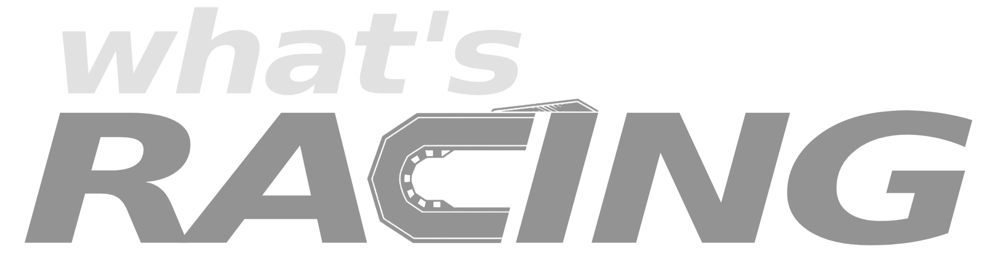
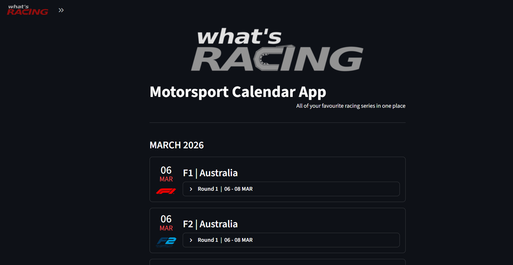
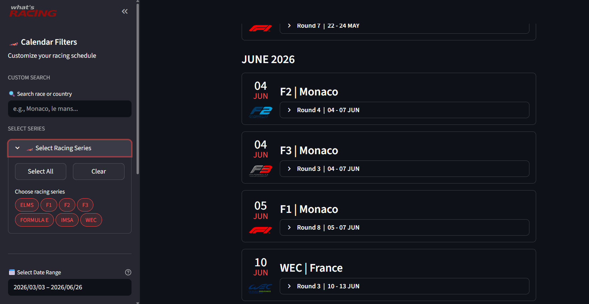
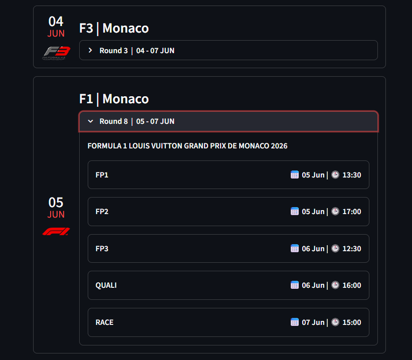
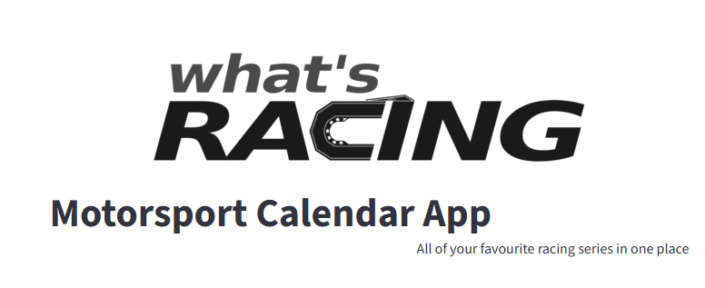
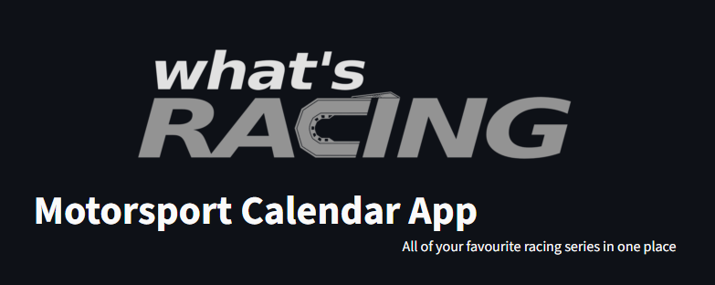

# what's RACING 🏁

Most popular motorsport calendar apps lack simplicity. They are often cluttered with news feeds, complicated navigation, and ads.

That's why **what's RACING** was created.

It's a simple, intuitive app built with one goal: to show you upcoming and historical races for all your favorite racing series in one clean interface. Look up any race, check the weekend schedule, and easily filter out what you don't need.

### 🏆 Supported Series (for now)
**F1** • **F2** • **F3** • **WEC** • **ELMS** • **IMSA** • **Formula E** 
*(More series coming soon!)*

---

### 📸 App Preview

**Main Dashboard & Sidebar Filtering**  
Find exactly what you are looking for using the custom search, date ranges, and series selection.

**Detailed Race Weekends**  
Expand any race card to see the exact session times (Practice, Qualifying, Race).

**Light & Dark Mode Support**  
The app automatically adapts to your system preferences. 

| ☀️ Light Mode | 🌙 Dark Mode |
| :---: | :---: |
|  |  |

---

### 🛠 Tech Stack

Built with simplicity and clean architecture in mind:

* **Python** — Core application logic
* **Streamlit** — Interactive frontend and UI components
* **Firebase (Firestore)** — NoSQL database for live calendar data updates